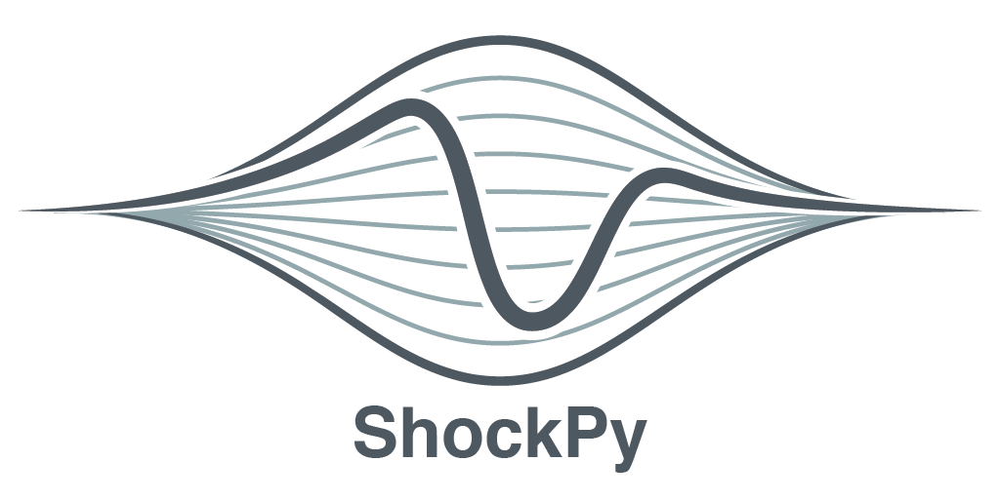
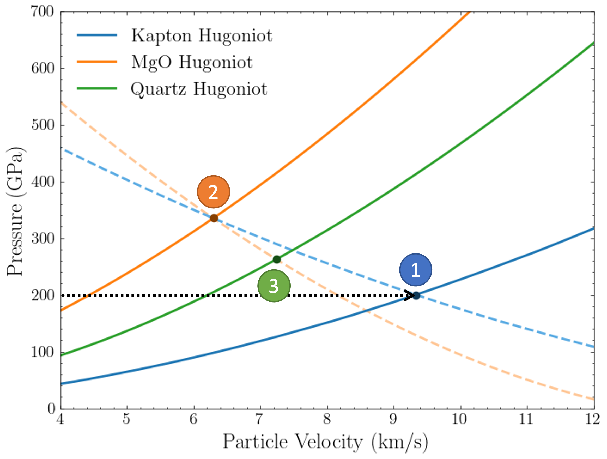

## Documentation 
https://dimtsap.github.io/ShockPy/

## Table of contents
* [General info](#general-info)
* [Methods-pipeline](#method)
* [Examples](#examples)
* [Contents](#contents)
* [Getting started](#getting-started)

## General info
This repository contains a library for modeling uncertainties in shock-wave experiments. 
Specifically, using available experimental shock velocity and particle velocity measurements derived from shock-wave experiments,
Bayesian parameter estimation is performed to enhance the until now deterministic analytical Hugoniot formulas with uncertainty measures.

By combining multiple materials with uncertain Hugoniot equations and the Impedance Matching technique, shock-wave experiments can now be replicated using analytical formulas.
This approach provides experimentalists with statistical data about the possible experimental outcomes and thus expedites the experimentla deisgn process.

## Method
Details of the methodology can be found in the paper [here](TBD).

## Application
Inside the [documentation](https://dimtsap.github.io/ShockPy/auto_examples/index.html) a set of examples can be found that illustrate the use of the code 
for both forward and backward propagation of the shock-wave experiments allowing the option of including uncertainty to the predicted outcomes. 
An illustration of forward experiment propagation for a three material experimental setup is provided below.  



## Contents


## Getting started
### Users
**1.** Create an Anaconda Python 3.9 virtual environment:
```
conda create -n shock_wave python==3.9
conda activate shock_wave
```

**3.** Install code and dependencies via the following commands: 

```  
pip install ShockPy
```

### Developers
Given that the goal of this library is to integrate a wide variety of material with uncertain Hugoniot representations,
all contributions to the library are encouraged. To assist this process a :code:`.devcontainer` is include in the library that 
allows for a replicable environment to be generated. This is environment is based on Centos 8 distribution due fortran 
dependencies of one of the first-principles libraries integrated. Despite that the process is streamlined and requires no 
further knowledge from the developers. 

Developers are encouraged to use Visual Studio code as it offers a seamless integration with DevContainer as they are auto-detected and the user is directly prompted to open and work on them.
For further info on DevContainer you can refer [here](https://code.visualstudio.com/docs/devcontainers/containers).

### Mainteners
[Dimitris Tsapetis](https://github.com/dimtsap)

:email: : dtsapet1@jhu.edu


