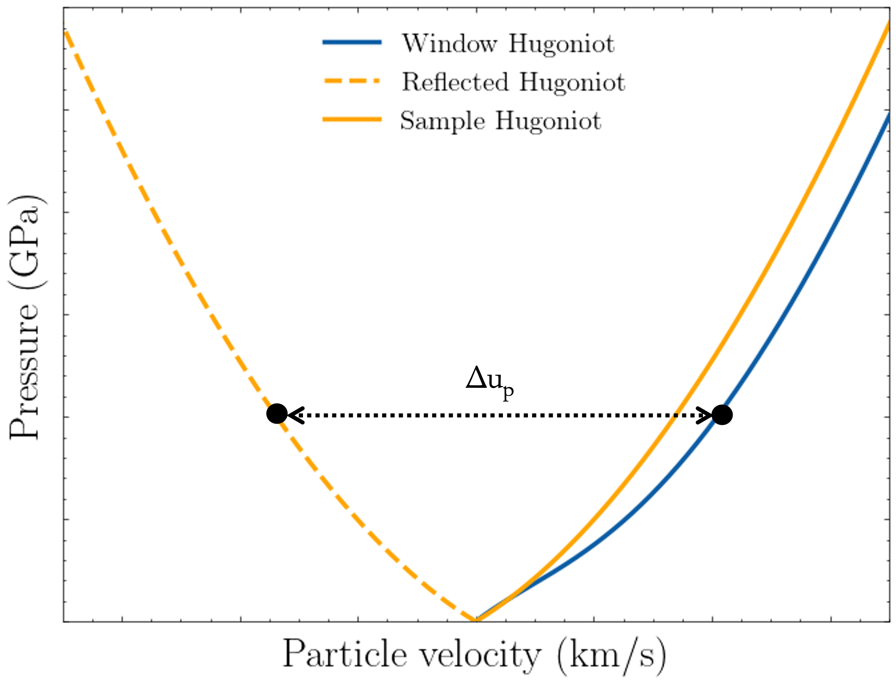

Hugoniot
--------------------
The class Hugoniot defined below is an dataclass that contains all relevant information for the shocked states of a material.
It contains multiple function with their main purpose being interpolating the data, such as :code:`interpolate_pressure`,
:code:`interpolate_shock_velocity` etc to accommodate the needs of a shock wave experiment propagation.
In addition the function :code:`reflected_hugoniot` documented below assist in the respective Isentrope calculation process.

Hugoniot Class
^^^^^^^^^^^^^^

Methods
~~~~~~~~~~~~~~~~~~
.. autoclass:: ImpedancePy.shock_wave_compression.material_states.Hugoniot
    :members: reflected_hugoniot

