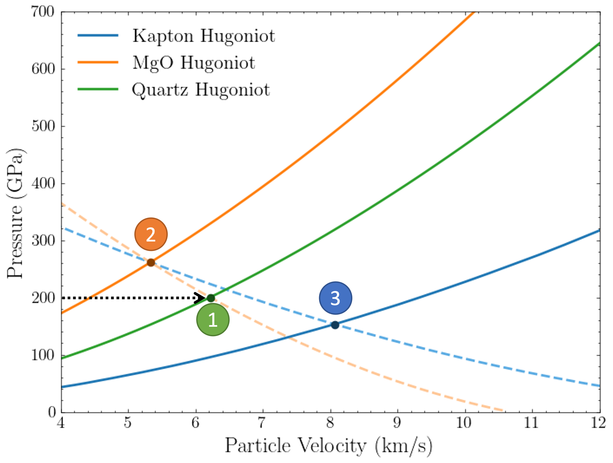

Uncertainty Propagation
================================

The goal of this library is to provide an tool to experimentalists in the field of shock-wave compression experiments to
predict the outcome of in an expedited manner. Until now, detailed Hydrocode software simulations that involved the
whole Equation of State (EOS) of materials are used, to predict the way a shock propagate through a sequence of
materials, thus replicating an experiment. This computationally expensive process can only replicate a small range of
initial conditions within a short time-frame while it does not account introduced errors, such deviations of the laser
drive, regions of EOS with limited results, etc.

These exact shortcomings is what the proposed library is trying to address, and provide a complimentary tool that can
reproduce the experiment in expedited manner while taking account the intrinsic uncertainties of the EOS and input
measurements.

At the same time, multiple sources of uncertainty can be taken into account, such as uncertain input pressure of the
experiment, uncertain material EOS, represented by its uncertain Hugoniots. All the above can provide experimentalists
with both an estimation of the final experimental results, as well as uncertainty measures in the form of distributions
and statistical moments of predicted final locus of predictions.

At the same time, a common practice for post-processing the results after an experiment, is to use the measured
quantities at the window layer and employ the Impedance Matching technique to infer the EOS of the sample material under
study. This backward propagation of an experiment has also been implemented in this framework, as a way to support the
experimentalist tools while providing measures of uncertainties.

Forward Experiment Propagation
--------------------------------

Shock-wave Experiment Class
^^^^^^^^^^^^^^^^^^^^^^^^^^^^^^

Methods
~~~~~~~~~~~~~~~~~~
.. autoclass:: ImpedancePy.shock_wave_compression.ShockWaveExperiment
    :members: run_experiment, plot

.. image:: _static/forward_experiment.png
   :scale: 20 %
   :alt: Forward propagation of shock-wave experiment using analytical equations
   :align: center

Backward Experiment Propagation
--------------------------------

Backward Shock-wave Experiment Class
^^^^^^^^^^^^^^^^^^^^^^^^^^^^^^^^^^^^^^

Methods
~~~~~~~~~~~~~~~~~~
.. autoclass:: ImpedancePy.shock_wave_compression.BackwardPropagationFromWindow
    :members: propagate, plot

Examples
--------------------------------

.. toctree::

   Shock-wave experiment examples <../auto_examples/index>